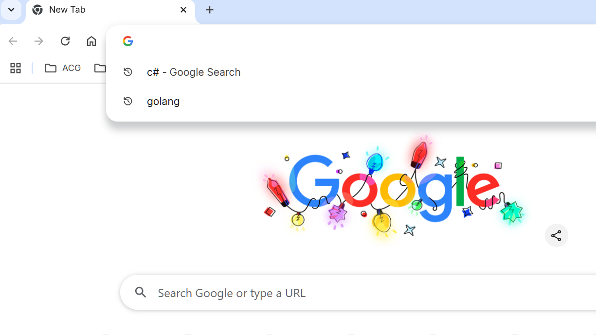

    

<h1>Omnibox History Suggestion Cleaner</h1>

A Chrome extension aims to clear omnibox search history suggestions.

## Installation
1. Download this repository and extract it
2. Open Chrome and navigate to chrome://extensions, then make sure Developer mode is enabled
3. Drag and drop "Omnibox History Suggestion Cleaner" folder onto the extensions page in Chrome

## Thanks
* [HCOS - Hide Chrome Omnibox Suggestions](https://chromewebstore.google.com/detail/hcos-hide-chrome-omnibox/aldijnffnfojelcpcfoekkeifffkhldo)
* [Icons8](https://icons8.com/icon/AsChNoRx9etU/genshin-impact)

## License
This project falls under the Apache License Version 2.0.